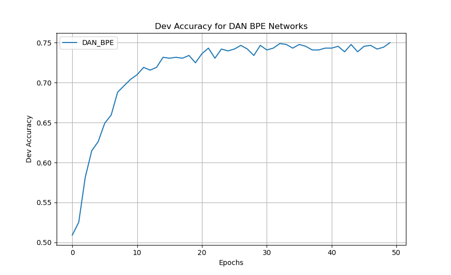

## This Repo is for CSE 256 LIGN 256 - Statistical Natural Lang Proc - Nakashole [FA24] PA1
### Author: [Zhecheng Li](https://github.com/Lizhecheng02) && Professor: [Ndapa Nakashole](https://ndapa.us/)

### Python Environment

#### 1. Install Packages

```b
pip install -r requirements.txt
```

### Prepare Data

- You need to put the ``glove.6B.50d-relativized.txt`` and ``glove.6B.300d-relativized.txt`` files under the **PA1/data** folder.

#### (1) You could download all data using Kaggle Api

```bash
export KAGGLE_USERNAME="your_kaggle_username"
export KAGGLE_KEY="your_api_key"
```

#### (2) Install unzip if you are using a GPU server

```bash
sudo apt install unzip
```

#### (3) Download datasets ([Link](https://kaggle.com/datasets/7d4c9051944b3f7d0ef7d6e47e20fe260eef79bd6f3335fef47e2582a292d5a5))

```bash
kaggle datasets download -d lizhecheng/cse256-pa-data
unzip cse256-pa-data.zip
```

### Run Codes

#### 1. Attention.
**You can modify ``hidden_sizes``, ``output_size``, ``use_dropout``, ``dropout_rate``, ``lr``, and ``epochs`` at any time.**

***Hint:** You are always recommended to set the ``freeze_embed`` to ``False`` to get better results.*

#### 2. If you want to use "DAN" model with random embedding.
- Find the ``config.yaml`` file.
- Change the model to ``"DAN"``.
- Set the ``use_random_embed`` to ``True``.
- You can set the ``vocab_size`` as large as possible, such as ``20,000`` or even larger.
- Run ``python main.py`` under PA1 folder.

#### 3. If you want to use "DAN" model with pretrained GloVe embedding.
- Find the ``config.yaml`` file.
- Change the model to ``"DAN"``.
- Set the ``use_random_embed`` to ``False``.
- You can set the ``embed_file`` to the path of the GloVe txt file, such as ``glove.6B.300d-relativized.txt``.
- The ``input_size`` should be the same as the dimension of the glove embedding, ``50`` or ``300``.
- Run ``python main.py`` under PA1 folder.

**If you run it successfully using ``300d`` embedding and three layers DAN model, with around ``10`` epochs, you could get the dev accuracy to about ``0.820`` - ``0.830``.**

<div style="text-align: center;">
    
</div>

#### 4. If you want to use "DAN" model with new trained BPE tokenizer.
- Find the ``config.yaml`` file.
- Change the model to ``"DAN"``.
- Set the ``use_random_embed`` to ``True``.
- Turn on the ``use_bpe_trainer`` to ``True``.
- You can set the ``bpe_vocab_size`` to be an integer, but recommend ``15,000`` to ``25,000``.
- You are recommended to set the ``epochs`` to ``30`` or even larger, and the ``lr`` could be a little bit higher, such as ``3.0e-4``.
- Run ``python main.py`` under PA1 folder.

**If you run it successfully using appropriate ``bpe_vocab_size``, you should be able to get around ``0.75`` - ``0.77`` dev accuracy, the best accuracy I've ever got is ``0.779``.**

<div style="text-align: center;">
    
</div>